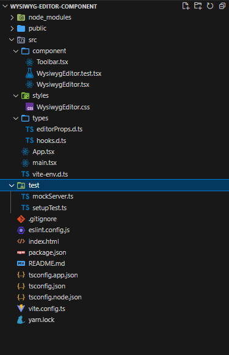

# WYSIWYG Editor Component

A reusable and flexible WYSIWYG Editor component built with React, TypeScript, and `draft-js`. The component supports both controlled and uncontrolled behavior, includes a customizable toolbar, and is fully tested using Vitest and MSW.

---

## Features

- **Controlled and Uncontrolled Modes**:
  - Controlled mode: Pass `value` and `onChange` props to manage the editor state externally.
  - Uncontrolled mode: The component manages its own state internally.
- **Customizable Toolbar**:
  - Default toolbar with **Bold**, *Italic*, and <u>Underline</u> formatting options.
  - Extend the toolbar using the `renderToolbar` prop.
- **Keyboard Shortcuts**:
  - `Ctrl + B` for Bold.
  - `Ctrl + I` for Italic.
  - `Ctrl + U` for Underline.
- **Async Behavior**:
  - Simulates loading content into the editor asynchronously.
  - Simulates saving edited content to a fake API using MSW.
- **Testing**:
  - Unit tests for toolbar functionality and editor behavior.
  - Integration tests for controlled and uncontrolled modes.
  - API mocking using MSW.

---

## Installation

1. **Clone the Repository**:
   ```bash
   git clone https://github.com/khederTa/wysiwyg-editor.git
   cd wysiwyg-editor
   ```

2. **Install Dependencies**:
   Using Yarn:
   ```bash
   yarn install
   ```

---

## Running the App

To start the development server, run:
```bash
yarn dev
```

Open your browser and navigate to `http://localhost:5173` to view the app.

---

## Running Tests

To run the unit and integration tests, use:
```bash
yarn test
```

This will execute all tests using Vitest and display the results in the terminal.

---

## Keyboard Shortcuts

The editor supports the following keyboard shortcuts:
- **Bold**: `Ctrl + B`
- **Italic**: `Ctrl + I`
- **Underline**: `Ctrl + U`

---

## Project Structure



---

## Dependencies

- **React**: UI library.
- **TypeScript**: Static typing.
- **draft-js**: Rich text editor framework.
- **Vitest**: Testing framework.
- **MSW**: API mocking for tests.

---

## License

This project is licensed under the MIT License. See the [LICENSE](LICENSE) file for details.